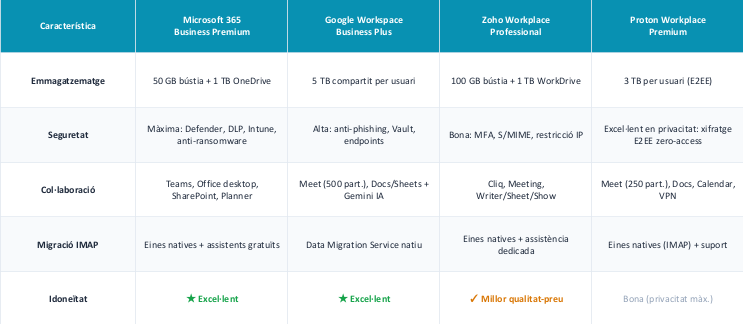
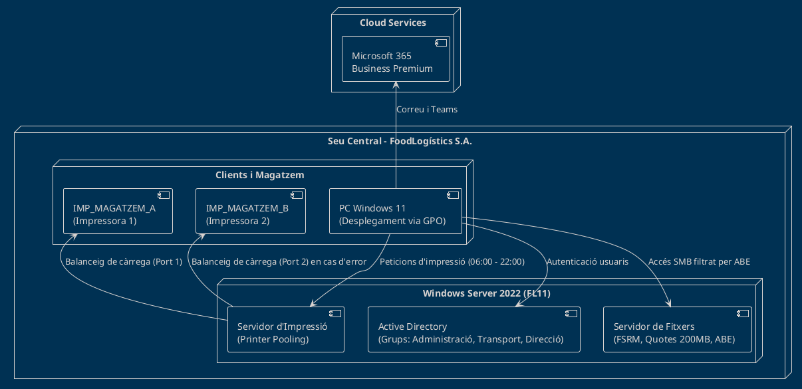
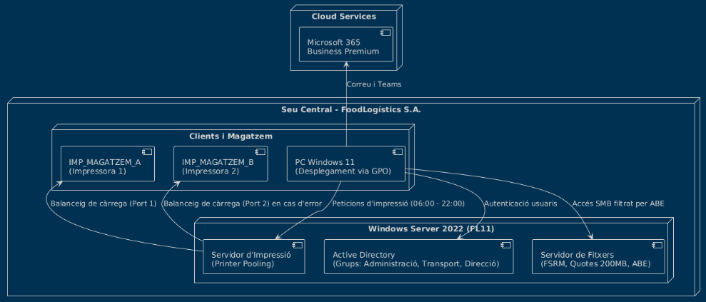
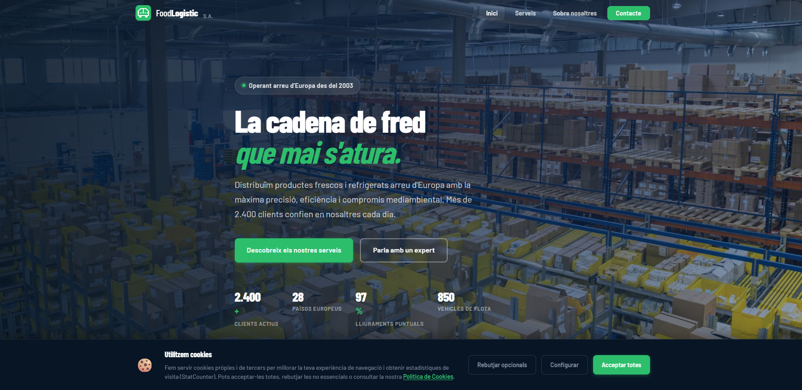
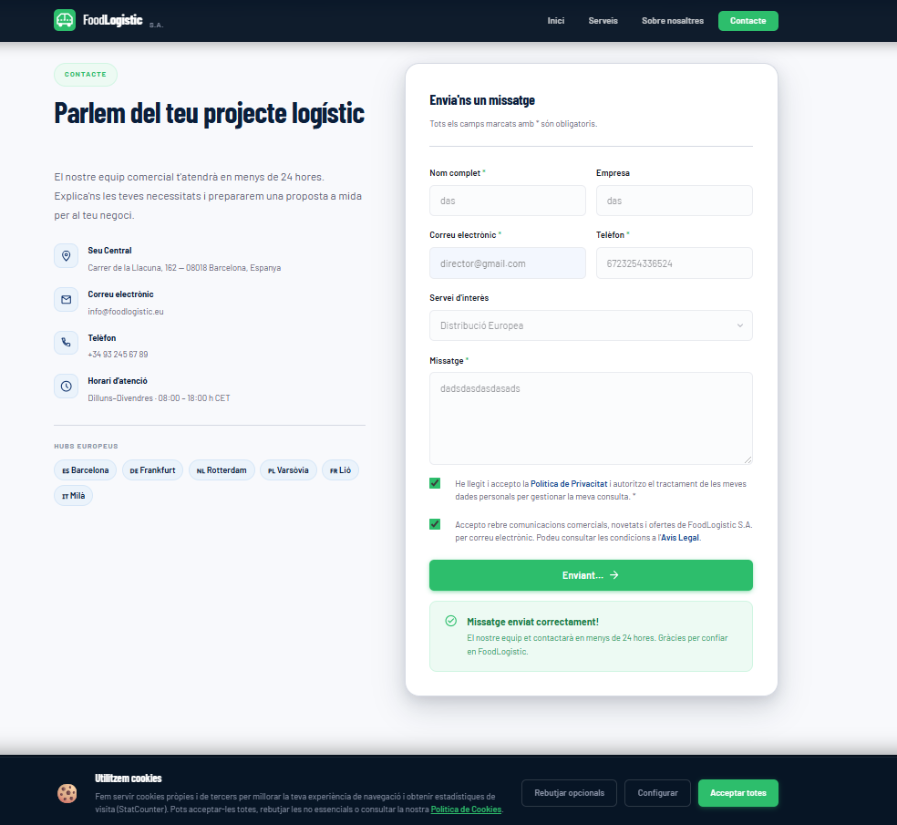
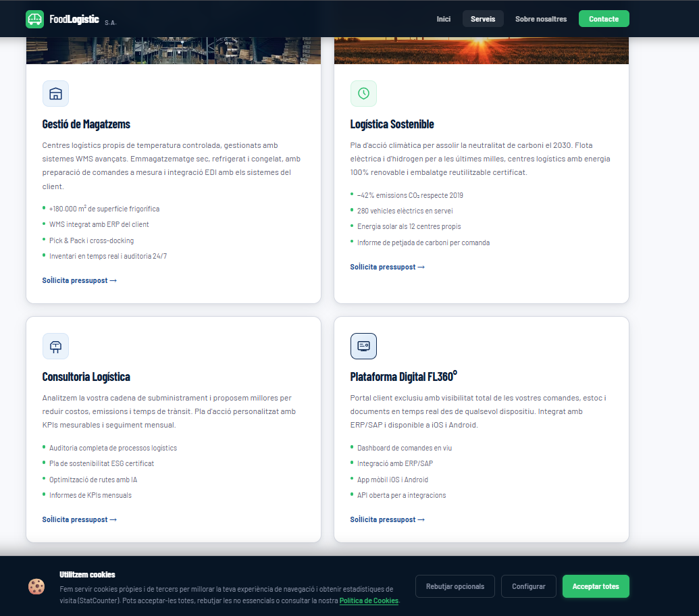

# P01: Memòria tècnica de la proposta - FoodLogístic S.A.

**Equip Tècnic:** Rui i Daniel Gallardo
**Projecte:** Modernització d'infraestructura, núvol i presència web.
**Client:** FoodLogístic S.A.

---

## 1. Introducció
FoodLogístic S.A. requereix una modernització integral i urgent de la seva infraestructura tecnològica. Aquesta memòria tècnica recull la proposta dissenyada pel nostre equip per garantir l'alta disponibilitat dels sistemes al magatzem, assegurar el compliment normatiu (LOPD-GDD) i modernitzar tant la presència web com els serveis de comunicació mitjançant la migració al núvol.

---

## 2. Anàlisi de necessitats
Hem identificat tres grans problemàtiques que llastren l'operativa diària de l'empresa, per a les quals proposem solucions tècniques directes:

| Problema detectat | Impacte a l'empresa | Solució proposada |
| :--- | :--- | :--- |
| **Col·lapse en la impressió d'albarans** | Retards en la sortida de camions i pèrdua de la cadena de fred. | **Printer Pooling (Alta Disponibilitat):** Balanceig de càrrega entre impressores. |
| **Correu antic i manca de col·laboració** | Pèrdua d'eficiència i emmagatzematge insuficient. | **Migració Cloud:** Entorn integrat a Microsoft 365 Business Premium. |
| **Incompliment normatiu de Dades** | Risc de sancions per part de l'AEPD i manca de conscienciació. | **Pla de Seguretat LOPD:** Restriccions per FSRM, web adaptada i formació als empleats. |

---

## 3. Proposta de solució

### 3.1 Infraestructura (relatiu a la T01)
Després d'analitzar competidors locals del Maresme (com *JSM Inforedes* o *Market Software*), hem detectat que la majoria s'enfoquen en manteniments genèrics i no ofereixen solucions especialitzades d'alta disponibilitat logística ni formació en privacitat. 
La nostra proposta d'infraestructura es diferencia oferint:
*   **Proximitat extrema:** Servei 100% local amb resposta ràpida.
*   **Especialització:** Infraestructura de servidors dissenyada per funcionar 24/7.
*   **Servei "clau en mà":** Suport, infraestructures, cloud i formació interna.

### 3.2 Serveis al núvol
Hem analitzat 4 proveïdors (Google Workspace, Microsoft 365, Zoho i Proton). Tot i que Zoho és més econòmic, la decisió tècnica final és **Microsoft 365 Business Premium**.

**Justificació tècnica de la tria:**
| Motiu | Descripció |
| :--- | :--- |
| **Seguretat Avançada** | Inclou Microsoft Defender, anti-ransomware i polítiques DLP (Prevenció de pèrdua de dades) essencials. |
| **Entorn Integrat** | Ofereix Teams, SharePoint i OneDrive (1TB) centralitzant tota l'operativa corporativa. |
| **Facilitat de Migració** | Permet migrar des del *hosting* antic de FoodLogístic utilitzant eines natives (IMAP) sense talls. |



### 3.3 Seguretat i LOPD
Per garantir el compliment del RGPD i la LOPD-GDD, hem aplicat mesures tant tècniques com humanes:
*   **Formació d'empleats:** Creació de dues càpsules audiovisuals. Una genèrica (sobre bloqueig de pantalles amb *Windows+L*, contrasenyes segures i impressió segura) i una específica per a Recursos Humans (gestió de currículums, contractes d'encarregat de tractament i els drets ARSULIPO) .
*   **Seguretat Web (Escut Digital):** Integració de banners de *cookies*, checkboxes de consentiment als formularis i l'esment explícit dels drets ARSLOP al *footer* de la pàgina.

### 3.4 Presència web
S'ha dissenyat una web híbrida fusionant el millor de les dues propostes individuals de l'equip:
*   **Impacte Visual (B2B):** Inclou un *hero* amb animació de comptadors, cronologia (*timeline*) de l'empresa, i cobertura explícita a escala europea.
*   **Valor Tecnològic i Captació:** Detall de serveis avançats (Plataforma Digital FL360°) i formularis de contacte optimitzats amb recollida de dades empresarials, maximitzant la conversió de clients .

---

## 4. Arquitectura i disseny tècnic

La xarxa corporativa local ha estat fortificada mitjançant Windows Server 2022. Hem aplicat el principi de *least privilege* estructurant l'Active Directory en tres OUs i tres Grups Globals: *Administracio*, *Transport* i *Direccio*.

**1. Servidor de Fitxers Segur (T03):**
*   **Quotes i límits:** Quota de volum NTFS de 500 MB i una *Hard Quota* FSRM de 200 MB a la carpeta *Public* amb avisos per correu.
*   **Privacitat per ABE:** Les carpetes com *Direccio* o *Operacions* estan ocultes per a usuaris sense permisos gràcies a l'Access-Based Enumeration [31, 32].
*   **File Screen:** Bloqueig actiu d'executables i fitxers multimèdia (.mkv, .exe) per evitar atacs de *ransomware*.

**2. Alta Disponibilitat d'Impressió (T04):**
S'han configurat dues impressores virtuals (`IMP_MAGATZEM_A` i `B`) fusionades amb **Printer Pooling**. El servidor balanceja les feines d'impressió automàticament i està limitat per GPO per funcionar exclusivament de 06:00 a 22:00.

### Diagrama de la infraestructura implantada






## 5. Part de la web (Evidències)

A continuació es mostren les captures de pantalla del disseny web finalitzat, on es demostra el compliment de la presència B2B europea i l'adaptació LOPDGDD.

Captura 1: Portada i Hero (Impacte B2B) 
Captura 2: Formulari i compliment LOPD 
Captura 3: Servei Plataforma FL360° 


## 6. Pressupost


**6.1 Cost d'Implantació (Pagament Únic)**
| Concepte | Detall | Hores | Cost |
| :--- | :--- | :---: | :--- |
| **Infraestructura (Maquinari/Setup)** | Servidors virtuals HA, llicències base i setup inicial. | - | 1.450,00 € |
| **Alta Disponibilitat (AD/FSRM/Print)** | Configuració AD, FSRM, quotes i printer pooling. | 24 h | 1.200,00 €  |
| **Migració Cloud i LOPD** | Setup Microsoft 365, guions, edició de vídeo LOPD. | 11 h | 550,00 €  |
| **Desenvolupament Web i Intranet** | Disseny de pàgina corporativa, Escut Digital i WordPress. | 30 h | 1.500,00 €  |
| **Gestió de Projecte** | Tria, Gantt i tràmits legals Startup. | 14 h | 700,00 €  |
| **TOTAL IMPLANTACIÓ** | (Maquinari + 79 hores de mà d'obra a 50€/h) | **79 h** | **5.400,00 €** |

**6.2 Costos Recurrents (Manteniment Mensual / Anual)**
| Servei | Cost Mensual | Cost Anual |
| :--- | :--- | :--- |
| **Subscripció Microsoft 365 Business Premium** (19,10€ x 35 usuaris) | 668,50 € | 8.022,00 €  |
| **Allotjament i Domini** (Hosting professional B2B) | 25,00 € | 300,00 €  |
| **Manteniment Tècnic Integral** (Backups, suport en <2h i actualitzacions) | 200,00 € | 2.400,00 € |
| **TOTAL RECURRENT** | **893,50 € / mes** | **10.722,00 € / any**  |

## 7. Planificació

Tota la implantació ha estat dissenyada per a ser executada i entregada sense demores en un termini tancat. S'ha establert un Diagrama de Gantt basat en el camí crític i una matriu RACI de repartiment de tasques.

```
@startgantt
Language ca
Project starts 2026-04-06
printscale daily zoom 1.5
header Diagrama de Gantt - Projecte FoodLogístics S.A.
footer Planificació i Assignació de Recursos (T09) - Rui i Daniel

<style>
ganttDiagram {
  task {
    .equip {
      BackgroundColor #DDEBF7
      LineColor #2E75B6
    }
    .indiv {
      BackgroundColor #FCE4D6
      LineColor #C55A11
    }
  }
  milestone {
    BackgroundColor #FFF2CC
    LineColor #D6A600
    FontStyle bold
  }
}
</style>

legend right
  | Color | Tipus |
  | <#DDEBF7> | En Equip (blau clar) |
  | <#FCE4D6> | Individual (taronja) |
end legend

-- Setmana 1: Recerca, Infraestructura i Web Base --
[T01 Competència i sector (4h)] <<equip>> on {Rui} {Daniel} lasts 2 days
[T02 Web corporativa (12h)] <<indiv>> on {Rui} {Daniel} lasts 4 days
[T03 Servidor de fitxers (16h)] <<indiv>> on {Rui} {Daniel} lasts 5 days

[T07 Migració al Cloud (4h)] <<equip>> on {Rui} lasts 2 days
[T07 Migració al Cloud (4h)] starts at [T01 Competència i sector (4h)]'s end

-- Setmana 2: Escut Legal, Impressió i Audiovisuals --
[T04 Servidor d'impressió (8h)] <<indiv>> on {Rui} {Daniel} lasts 3 days
[T04 Servidor d'impressió (8h)] starts at [T03 Servidor de fitxers (16h)]'s end

[T05 Vídeo formatiu LOPD (7h)] <<equip>> on {Rui} lasts 3 days
[T05 Vídeo formatiu LOPD (7h)] starts at [T07 Migració al Cloud (4h)]'s end

-- Setmana 3: Web Legal, Pressupost, Startup i Tancament --
[T06 Escut Digital LOPD (6h)] <<indiv>> on {Rui} {Daniel} lasts 2 days
[T06 Escut Digital LOPD (6h)] starts 2026-04-20

[T08 Tria web definitiva (2h)] <<equip>> on {Rui} {Daniel} lasts 1 days
[T08 Tria web definitiva (2h)] starts at [T06 Escut Digital LOPD (6h)]'s end

[T10 Pressupost projecte (4h)] <<equip>> on {Rui} {Daniel} lasts 2 days
[T10 Pressupost projecte (4h)] starts at [T08 Tria web definitiva (2h)]'s end

[T11 Intranet WordPress (10h)] <<indiv>> on {Rui} {Daniel} lasts 3 days
[T11 Intranet WordPress (10h)] starts at [T10 Pressupost projecte (4h)]'s end

[T12 TechLaunch Startup (7h)] <<equip>> on {Rui} {Daniel} lasts 3 days
[T12 TechLaunch Startup (7h)] starts at [T10 Pressupost projecte (4h)]'s end

[T09 Planificació Gantt (4h)] <<equip>> on {Rui} {Daniel} lasts 2 days
[T09 Planificació Gantt (4h)] starts at [T12 TechLaunch Startup (7h)]'s end

[Lliurament Memòria P01 i Web P02] happens at [T09 Planificació Gantt (4h)]'s end
@endgantt
```


## 8. Conclusions

La proposta tecnològica dissenyada per a FoodLogístics S.A. soluciona d'arrel les deficiències de la seva infraestructura clàssica
. La implementació de Printer Pooling i l' Access-Based Enumeration al servidor local garanteixen operativitat ininterrompuda als magatzems i privacitat extrema. Sumat a l'escut digital LOPD, a la formació del personal i a l'entorn securitzat de Microsoft 365, entreguem una solució completament "clau en mà" que posiciona FoodLogístics com a empresa logística referent a escala europea, capaç d'assumir reptes empresarials de forma totalment resilient.

---
[Tornar enrere](README.md)