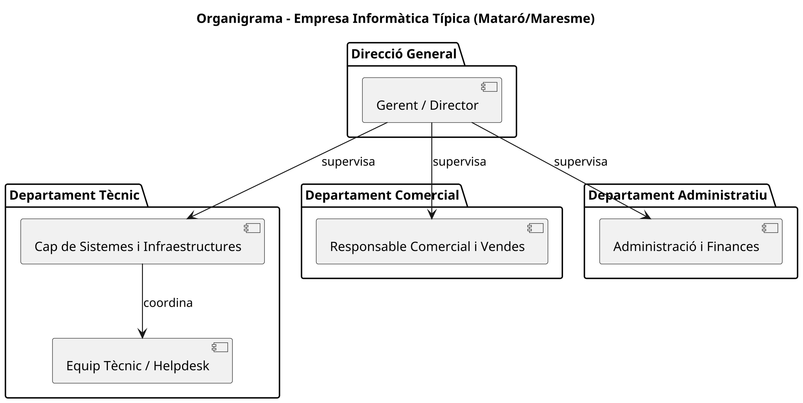

# T01: Coneixent la competència i el sector

## 📖 Introducció
Hem fundat una nova empresa de serveis informàtics a **Mataró**. Tot i que estem arrencant, se'ns ha presentat una oportunitat d'or: **FoodLogístic S.A.**, una empresa de logística alimentària del Polígon de les Hortes, necessita una renovació integral de la seva infraestructura.

Aquest document recull l'anàlisi del sector i la nostra proposta estratègica per guanyar el projecte davant la competència local.

---

## 🔍 Fase 1: Coneixent el terreny i la competència

### 1.1 Recerca de mercat
Identificació de 3 empreses reals de serveis informàtics al Maresme:

| Empresa | Mida | Serveis Principals | Ubicació |
| :--- | :--- | :--- | :--- |
| **Exemple 1** | PIME | Manteniment, Cloud, Ciberseguretat | Mataró |
| **Exemple 2** | Microempresa | Suport tècnic, Venda de hardware | Vilassar de Mar |
| **Exemple 3** | PIME | Desenvolupament de Software i Xarxes | Mataró |

### 1.2 L'organigrama (Estructura organitzativa)
A continuació es presenta l'estructura típica d'una empresa de serveis informàtics del sector, dissenyada amb **PlantUML**.

### 1.3 Radiografia de departaments
Funcions principals de l'estructura proposada:

Sistemes i Xarxes: Responsables de la infraestructura física, servidors i seguretat de dades del client.

Suport / Helpdesk: Atenció directa a l'usuari final de FoodLogístic per a incidències del dia a dia.

Comercial: Gestió de pressupostos, seguiment de la satisfacció del client i detecció de noves necessitats.

Administració: Gestió de factures, contractes i comptabilitat de l'empresa.

---

## 🚀 Fase 2: Estratègia
### 2.1 Definició de l'estratègia
Per diferenciar-nos de la competència a Mataró, la nostra proposta de valor es basa en:

Proximitat i Resposta Immediata: En estar ubicats a la mateixa ciutat, garantim presència física en menys de 30 minuts en cas de fallada crítica.

Especialització Logística: Adaptem la infraestructura a les necessitats de la cadena de fred i el control d'estoc en temps real.

Monitoratge 24/7: Servei proactiu per evitar aturades en la distribució alimentària.

### 2.2 Recursos necessaris
Per donar servei a FoodLogístic S.A., hem definit el següent equip:

Equip Intern: (Membres del grup) actuant com a caps de projecte i tècnics de nivell 1.

Necessitats de contractació: Caldrà incorporar un Tècnic de Sistemes Sènior amb experiència en servidors virtualitzats per a la fase de desplegament inicial.

Recursos materials: Unitat de transport pròpia i eines de diagnòstic de xarxes certificades.

---

## 📤 Entrega

Format: Document conjunt en Markdown.

Ubicació: Repositori GitHub de cada membre del grup.

Justificació: Totes les propostes s'han basat en les tarifes i necessitats actuals del sector logístic al Maresme.

### Consells per al diagrama:
1.  Si utilitzes **Visual Studio Code**, instal·la l'extensió "PlantUML" per veure el gràfic.
2.  Pots copiar el codi que hi ha dins del bloc `@startuml ... @enduml` i enganxar-lo a [PlantText.com](https://www.planttext.com/) per generar la imatge i descarregar-la si vols adjuntar-la com a fitxer `.png`.

[solucio](solucio.md)