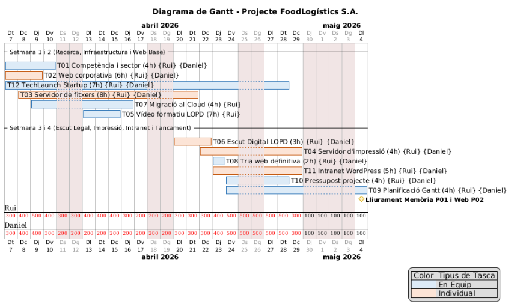

Daniel Gallardo Rodriguez, 3 min, Editat
# T09: Estimació Temporal de Projecte — FoodLogístics S.A.

**Equip Tècnic:** Daniel Gallardo i Rui Huang
**Durada del projecte:** 4 setmanes *(del 7 d'abril al 4 de maig de 2026)*
**Client:** FoodLogístics S.A.

---

## 1. Introducció i Context

La direcció de **FoodLogístics S.A.** ha sol·licitat una modernització integral de la seva infraestructura tecnològica, abastant des de l'alta disponibilitat dels servidors fins a la legalització de la seva presència web i la migració al núvol. Aquest document recull la **planificació estratègica** del desplegament de la solució.

L'objectiu no és només executar tasques tècniques, sinó garantir-ne el lliurament dins del termini establert, evitant colls d'ampolla mitjançant una **assignació eficient de recursos** i un **pla de contingència robust**.

---

## Fase 1: Anàlisi Estructural (Dependències i Camí Crític)

Abans d'assignar hores, s'ha realitzat un estudi de les **dependències lògiques** de les 12 tasques del projecte per a FoodLogístics S.A. d'acord amb el calendari establert.

### 1.1 Ordre Lògic i Tasques Bloquejants (Dependències)

- La **T06 (Escut Digital)** depèn estrictament de la **T02 (Web Corporativa)**: La normativa i les instruccions requereixen tenir feta i acabada la T02 per poder aplicar-hi els textos legals.
- La **T08 (Tria de web definitiva)** depèn de la **T02**: És impossible debatre i consensuar una proposta final si prèviament no s'han dissenyat les webs individuals.
- La **T10 (Pressupost)** depèn de l'arquitectura tècnica **(T03, T04, T07 i T02)**: No es pot calcular el cost d'implantació ni el manteniment recurrent (hores, llicències, SaaS) sense haver definit prèviament les solucions.

### 1.2 Tasques en Paral·lel (Optimització de Recursos)

- **Track Web vs. Track Sistemes:** La configuració de l'Active Directory i les quotes del Servidor de Fitxers (T03) s'executa simultàniament a la creació de la pàgina corporativa (T02).
- **Recerca i Documentació:** Tasques com l'Estudi de la Competència (T01), la Migració Cloud (T07) i el disseny de la Startup (T12) s'han distribuït en paral·lel a les fases tècniques més dures.

### 1.3 Identificació del Camí Crític

El **camí crític** és la seqüència de tasques amb marge zero d'error; qualsevol retard compromet l'entrega final al client. En aquest projecte, el camí més sensible és el **Track Web i Pressupostari**:

>  **T02** (Web) → **T06** (Escut Digital) → **T08** (Tria web) → **T10** (Pressupost) → **P01** (Memòria)

Si s'endarrereix el codi HTML **(T02)**, no es pot legalitzar la pàgina **(T06)**, cosa que bloqueja la tria de la solució final **(T08)**. Sense aquesta tria, el pressupost **(T10)** no es pot tancar, impedint l'entrega de la **Memòria Tècnica (P01)**.

---

## Fase 2: Estimació d'Esforç i Justificació de Càrrega

S'ha realitzat una estimació contemplant la comprensió, recerca, implementació tècnica, documentació i coordinació.

### 2.1 Taula d'Hores per Tasca

| ID   | Tasca                  | Tipus  | Hores Totals | Hores Rui | Hores Daniel | Justificació de la divisió |
|------|------------------------|--------|:------------:|:---------:|:------------:|----------------------------|
| T01  | Competència i sector   | Equip  | 4 h          | 4 h       | 1 h          | Rui assumeix el pes de la recerca i l'organigrama; Daniel dedica 1 h a revisar el document. |
| T02  | Web corporativa        | Indiv. | 6 h          | 6 h       | 6 h          | Tasca individual. Ambdós inverteixen 6 h en dissenyar la seva pròpia web i configurar GitHub. |
| T03  | Servidor de fitxers    | Indiv. | 8 h          | 8 h       | 8 h          | Tasca individual tècnica i feixuga. Cadascú configura el seu AD, permisos i quotes en les seves màquines. |
| T04  | Servidor d'impressió   | Indiv. | 4 h          | 4 h       | 4 h          | Cadascú inverteix 4 h en configurar el Printer Pooling i desplegar per GPO. |
| T05  | Vídeo formatiu LOPD    | Equip  | 7 h          | 6 h       | 1 h          | Rui lidera la gravació, edició i guions dels vídeos (6 h); Daniel fa suport i validació (1 h). |
| T06  | Escut Digital (Legal)  | Indiv. | 3 h          | 3 h       | 3 h          | Ambdós apliquen les normatives a les seves webs individuals de la T02. |
| T07  | Migració al Cloud      | Equip  | 4 h          | 4 h       | 2 h          | Rui assumeix la investigació i proposta del correu Cloud; Daniel inverteix 2 h en revisió. |
| T08  | Tria web definitiva    | Equip  | 2 h          | 2 h       | 2 h          | Reunió conjunta obligatòria per debatre i consensuar la proposta final. |
| T09  | Planificació (Gantt)   | Equip  | 4 h          | 4 h       | 2 h          | Rui lidera el disseny del Gantt i la documentació; Daniel audita els temps. |
| T10  | Pressupost projecte    | Equip  | 4 h          | 2 h       | 4 h          | Tasca equilibrada per tancar costos d'implantació i recurrents. |
| T11  | Intranet WordPress     | Indiv. | 5 h          | 5 h       | 5 h          | Tasca individual on cadascú desplega el seu WordPress. |
| T12  | TechLaunch Startup     | Equip  | 7 h          | 7 h       | 7 h          | Rui assumeix els tràmits legals de la Llei 28/2022; Daniel ajuda activament en el Pitch. |
| —    | **TOTAL INDIVIDUAL**   | —      | —            | **26 h**  | **26 h**     | Esforç idèntic en el desenvolupament tècnic individual. |
| —    | **TOTAL EQUIP**        | —      | —            | **29 h**  | **19 h**     | Desbalanceig assumit estratègicament per tasques de gestió. |
| —    | **GRAN TOTAL**         | —      | —            | **55 h**  | **45 h**     | Total per persona al llarg de les 4 setmanes de projecte. |

### 2.2 Justificació de l'Anàlisi de Càrregues

Com es pot observar, les tasques tècniques individuals (**T02, T03, T04, T06 i T11**) s'han executat en paral·lel consumint de manera equilibrada **26 hores per tècnic**.

No obstant això, en les tasques d'equip, s'ha aplicat una **distribució asimètrica** per evitar temps morts. En Rui ha assumit un lideratge en la producció documental i audiovisual (T01, T05, T07, T09), generant una desviació de **55 hores globals** envers les **45 hores** d'en Daniel. Aquesta decisió de gestió ens ha permès complir els terminis i protegir el camí crític.

---

## Fase 3: Matriu d'Assignació de Responsabilitats (RACI)

> **Llegenda:** R = Realitzador · A = Aprovador/Revisor · C = Consultat · I = Informat

| ID   | Tasca                  | Rui | Daniel | Justificació dels rols |
|------|------------------------|:---:|:------:|------------------------|
| T01  | Competència i sector   | R   | A      | Rui investiga i elabora el document (4 h); Daniel el valida (1 h). |
| T02  | Web corporativa        | R   | R      | Tasca individual: tots dos maqueten la seva pròpia versió en paral·lel. |
| T03  | Servidor de fitxers    | R   | R      | Tasca individual: execució tècnica autònoma d'AD i quotes FSRM. |
| T04  | Servidor d'impressió   | R   | R      | Tasca individual: configuració autònoma de PDF24 i GPOs. |
| T05  | Vídeo formatiu LOPD    | R   | C      | Rui assumeix el gran pes del muntatge audiovisual (6 h); Daniel aconsella i avalua (1 h). |
| T06  | Escut Digital (Legal)  | R   | R      | Tasca individual: aplicació de banners i cookies a les webs de la T02. |
| T07  | Migració al Cloud      | R   | A      | Rui elabora l'estudi de mercat; Daniel aprova tècnicament la solució. |
| T08  | Tria web definitiva    | R   | R      | Colideratge: debat i negociació conjunta exigida. |
| T09  | Planificació (Gantt)   | R   | A      | Rui dissenya el Markdown i el Gantt; Daniel audita els calendaris. |
| T10  | Pressupost projecte    | R   | R      | Treball col·laboratiu en el càlcul financer de la implantació. |
| T11  | Intranet WordPress     | R   | R      | Tasca individual: instal·lació i documentació pròpia. |
| T12  | TechLaunch Startup     | R   | R      | Execució en equip per als tràmits i gravació de la presentació oral. |

---

## Fase 4: Distribució Setmanal i Diagrama de Gantt

La planificació setmanal reflecteix fidelment la temporalització real des del **07/04/2026** fins al lliurament el **04/05/2026**, treballant exclusivament de dilluns a divendres i respectant els dies festius o de lliure disposició (**30/04 i 01/05**), distribuïts de la següent manera:

- **Setmana 1 (del 07/04 al 10/04):** Investigació inicial (T01), desenvolupament web base (T02), inici del disseny de la Startup (T12) i arrancada de l'Active Directory (T03) i Cloud (T07).
- **Setmana 2 (del 13/04 al 17/04):** Enregistrament del material de la LOPD (T05) i aprofundiment de les configuracions d'infraestructura (T03 i T07).
- **Setmana 3 (del 20/04 al 24/04):** Convergència del camí crític aplicant legalitat a la web (T06), instal·lació del servidor d'impressió (T04), inici del Gantt (T09) i desenvolupament d'intranet (T11).
- **Setmana 4 i tancament (del 27/04 al 04/05):** Formalització de la tria web i pressupost (T08 i T10), finalització de tràmits i impressores, parada pel pont (30/04 i 01/05) i lliurament definitiu de la Memòria Tècnica i Planificació el **dia 4 de maig**.

### 4.1 Diagrama de Gantt




```
@startgantt
language ca
Project starts 2026-04-07
saturday are closed
sunday are closed
2026-04-30 is closed
2026-05-01 is closed

printscale daily zoom 1.5
title Diagrama de Gantt - Projecte FoodLogístics S.A.
footer Planificació i Assignació de Recursos (T09) - Rui i Daniel

<style>
ganttDiagram {
  task {
    FontName Arial
    FontSize 12
  }
  .equip {
    BackGroundColor #DDEBF7
    LineColor #2E75B6
  }
  .indiv {
    BackGroundColor #FCE4D6
    LineColor #C55A11
  }
  milestone {
    BackGroundColor #FFF2CC
    LineColor #D6A600
    FontStyle bold
  }
}
</style>

-- Setmana 1 i 2 (Recerca, Infraestructura i Web Base) --
[T01 Competència i sector (4h)] <<equip>> on {Rui} {Daniel} starts 2026-04-07 and ends 2026-04-10
[T02 Web corporativa (6h)] <<indiv>> on {Rui} {Daniel} starts 2026-04-07 and ends 2026-04-09
[T12 TechLaunch Startup (7h)] <<equip>> on {Rui} {Daniel} starts 2026-04-07 and ends 2026-04-28
[T03 Servidor de fitxers (8h)] <<indiv>> on {Rui} {Daniel} starts 2026-04-08 and ends 2026-04-21
[T07 Migració al Cloud (4h)] <<equip>> on {Rui} starts 2026-04-09 and ends 2026-04-16
[T05 Vídeo formatiu LOPD (7h)] <<equip>> on {Rui} starts 2026-04-13 and ends 2026-04-15

-- Setmana 3 i 4 (Escut Legal, Impressió, Intranet i Tancament) --
[T06 Escut Digital LOPD (3h)] <<indiv>> on {Rui} {Daniel} starts 2026-04-20 and ends 2026-04-22
[T04 Servidor d'impressió (4h)] <<indiv>> on {Rui} {Daniel} starts 2026-04-22 and ends 2026-04-29
[T08 Tria web definitiva (2h)] <<equip>> on {Rui} {Daniel} starts 2026-04-23 and ends 2026-04-23
[T11 Intranet WordPress (5h)] <<indiv>> on {Rui} {Daniel} starts 2026-04-23 and ends 2026-04-29
[T10 Pressupost projecte (4h)] <<equip>> on {Rui} {Daniel} starts 2026-04-24 and ends 2026-04-28
[T09 Planificació Gantt (4h)] <<equip>> on {Rui} {Daniel} starts 2026-04-24 and ends 2026-05-04

[Lliurament Memòria P01 i Web P02] happens at 2026-05-04

legend right
| Color | Tipus de Tasca |
| <#DDEBF7> | En Equip |
| <#FCE4D6> | Individual |
end legend
@endgantt

```

## Fase 5: Taula de Riscos i Contingències

| Risc detectat | Part del projecte afectada | Impacte en la planificació | Mesura de contingència |
|---------------|---------------------------|---------------------------|------------------------|
| Coll d'ampolla per sobrecàrrega de l'executor principal (Rui). | T05 (Vídeo LOPD), T09 (Gantt) i globals. | **Alt.** En Rui assumeix 55 h globals front a les 45 h d'en Daniel. Una incidència mèdica o bloqueig per part d'en Rui posaria en perill l'entrega completa. | **Redistribució dinàmica.** Si s'arriba al 70% del temps a la T05 o T03 sense acabar, en Daniel paralitza les seves tasques individuals per assumir edició o programació compartida, equilibrant la càrrega per no trencar terminis. |
| Corrupció de la Màquina Virtual (Active Directory) o problemes GPO. | T03 (Fitxers) i T04 (Impressió). | **Alt.** Aturaria el track d'infraestructura de sistemes causant un retard de diversos dies si es perd la feina prèvia feta per FSRM o les quotes. | **Política de Snapshots agressiva.** Es realitzarà una captura de la MV abans d'implementar el rol File Server Resource Manager i aplicar GPOs per poder restaurar immediatament el sistema. |
| Endarreriment en la programació web base. | T02 (Web corporativa), T06 i T08. | **Crític.** Bloqueja el camí crític. Sense web, no s'hi pot afegir política de privacitat (T06) i impossibilita reunir l'equip per triar (T08). | **Timeboxing.** S'estableix un límit innegociable de 6 h per desenvolupar l'HTML/CSS. Si se supera el temps per temes estètics, es forçarà l'ús de plantilles funcionals per seguir avançant. |

---

## 6. Respostes a les Preguntes Obligatòries de Planificació

### 1. Quina és la tasca més crítica del projecte i per què?

La tasca més crítica és la **T02 (Web corporativa)**. És l'arrel de tot el camí crític del bloc front-end i pressupost. Si s'endarrereix, impossibilita aplicar-hi les capes legals LSSI/CE **(T06)** i bloqueja directament la dinàmica d'equip per a l'elecció de la web definitiva **(T08)**. Com a efecte dòmino, sense web definitiva no es pot tancar el pressupost **(T10)** de la Memòria Tècnica **P01**.

---

### 2. On heu detectat el principal coll d'ampolla?

A **inicis de la Setmana 3 i 4**. En aquest espai temporal convergeixen les operacions tècniques seqüencials de la web corporativa i els textos legals de protecció de dades **(T06)** i tot el bloc financer, de planificació i administratiu **(T09, T10 i T12)**, tenint en compte a més els dos dies sense classe.

---

### 3. Quina decisió de planificació ha estat més difícil?

Prendre la decisió madura d'**evitar l'equilibri artificial del 50/50** en l'assignació d'hores col·laboratives. Basant-nos en el realisme de les necessitats, hem assumit oficialment una desviació de pes de treball on l'integrant **Rui assumeix 55 hores** davant les **45 hores** de l'integrant **Daniel**, per tal de blindar el projecte de temps morts.

---

### 4. Heu hagut de modificar alguna estimació inicial? Per què?

Sí, la càrrega de la **T05** (Vídeos formatius LOPD) i **T03** (Servidor de fitxers). L'estimació inicial no preveia l'elevat cost de temps que suposa fer les comprovacions d'errors creuats en l'Active Directory al donar d'alta quotes, i el pes real d'editar material multimèdia amb locucions sobre la LOPD.

---

### 5. Quin risc podria fer fracassar el projecte?

Una **corrupció estructural del domini** a nivell de Group Policies (GPO) a la meitat de la segona setmana sumat a una **absència per motius de salut** de l'integrant sobrecarregat (Rui). El marge d'error és nul.

---

### 6. Si tinguéssiu una setmana més, què canviaríeu?

Aplicaríem **Stress Testing**. Invertiríem els dies extra a sotmetre la carpeta compartida **(T03)** i les impressores d'alta disponibilitat **(T04)** a proves d'estrès massives simulant usuaris concurrents, a més de poder dedicar un temps necessari a l'**optimització responsive** de la landing page definitiva del client.

---

